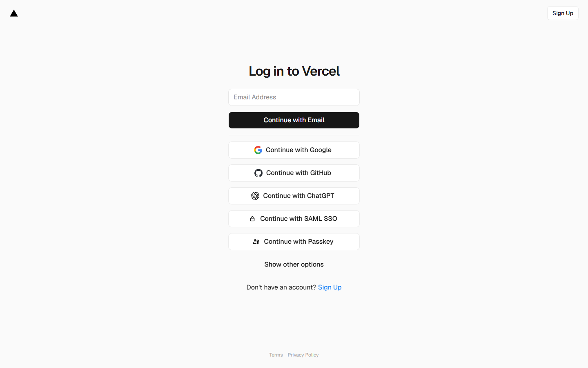

# ProofFactor

> Finance the invoice, not the company's secrets.

ProofFactor is a privacy-preserving B2B invoice verification and financing demo for Midnight. A supplier commits an invoice, an authorized buyer attests to it, and a lender can verify policy eligibility without publishing the invoice amount, due date, reference, or raw business data.

## Current status

The repository contains:

- A responsive React application with supplier, buyer, lender, public-explorer, and guided-demo views.
- Injected Midnight wallet discovery with an explicitly labeled demo-wallet fallback.
- A Compact 0.31.1 contract with 13 circuits and generated proving/verifying artifacts.
- Contract simulator tests for role authorization, lifecycle transitions, supplier control, stable-nullifier reuse prevention, and block-time expiry.
- Frontend state-machine and interaction tests.

The local product demo is complete. A live Preprod deployment is intentionally not claimed: it still requires a funded Preprod Lace wallet, a running proof server, and recording the resulting contract address and transaction ID.

## Privacy boundary
## Live demo

**Vercel deployment:** [proff-factor-5674jjdnn-sm-17fa.vercel.app](https://proff-factor-5674jjdnn-sm-17fa.vercel.app/)

### Submission evidence




The published demo uses synthetic data and clearly labels local/demo actions. It does not claim live Midnight transaction submission.


Private inputs:

- Invoice reference and salt
- Supplier and buyer identities before selective disclosure
- Amount, currency, and due date
- Supplier control secret
- Buyer nullifier nonce
- Role secrets used to derive admin, buyer, and lender identities

Public ledger state:

- Invoice commitment
- Pseudonymous buyer identity
- Supplier control key
- Stable invoice nullifier after buyer acceptance
- Lifecycle status and selected policy ID
- Public lender policy ranges and deadlines

The contract proves that a committed invoice satisfies a selected policy. It does not settle fiat payments, validate the legal authenticity of source documents, or hide transaction timing.

## Quick start

Requirements:

- Node.js 22 or newer
- npm 10 or newer
- WSL2 Ubuntu on Windows
- Compact devtools 0.5.1 with compiler 0.31.1
- Docker Desktop for proof generation

Install and verify:

```powershell
npm install
npm run compile:contract
npm run typecheck
npm test
npm run build
```

Run the interactive app:

```powershell
npm run dev
```

Open `http://localhost:5173` for the product landing page. Select **Explore the workspace** or open `http://localhost:5173/app` to enter the interactive dashboard. Without an injected Midnight wallet, choose the clearly labeled demo wallet to explore the complete synthetic workflow.

## Proof server

Start the pinned local proof server:

```powershell
docker compose -f proof-server.yml up -d
docker compose -f proof-server.yml ps
```

It listens on `http://127.0.0.1:6300`. Stop it with:

```powershell
docker compose -f proof-server.yml down
```

## Repository map

```text
app/                         React/Vite product interface
contract/src/prooffactor.compact
                             Compact source
contract/src/prooffactor.test.ts
                             In-memory contract invariant tests
contract/src/managed/        Generated bindings, ZK IR, and keys
docs/ARCHITECTURE.md         Components and transaction boundaries
docs/PRIVACY.md              Public/private data and limitations
docs/DEMO.md                 Repeatable judging walkthrough
plan.md                      Living delivery and competition plan
VERSIONS.md                  Pinned Midnight compatibility set
```

## Important scripts

| Command | Purpose |
|---|---|
| `npm run dev` | Start the frontend |
| `npm run compile:contract` | Compile all Compact circuits |
| `npm run typecheck` | Type-check every workspace |
| `npm test` | Run frontend and contract tests |
| `npm run build` | Compile the contract and build the production app |
| `npm run check` | Run the full local quality gate |

## Preprod release checklist

1. Install and unlock Midnight Lace on Preprod.
2. Fund the wallet with test tokens through the official faucet.
3. Start proof server 8.1.0.
4. Replace demo transport with the Midnight.js 4.1.1 contract provider.
5. Deploy the generated ProofFactor contract artifacts.
6. Record the contract address and deployment transaction in `plan.md`.
7. Exercise supplier registration, buyer acceptance, financing request, lender confirmation, and paid status with real transactions.
8. Publish the frontend and record the deployment URL.

See [plan.md](./plan.md) for the complete requirement and evidence register.

## Safety

ProofFactor is a competition prototype, not audited financial software. Use synthetic invoice data only. Never commit wallet seeds, mnemonics, private state, customer documents, or real invoice data. See [SECURITY.md](./SECURITY.md).
